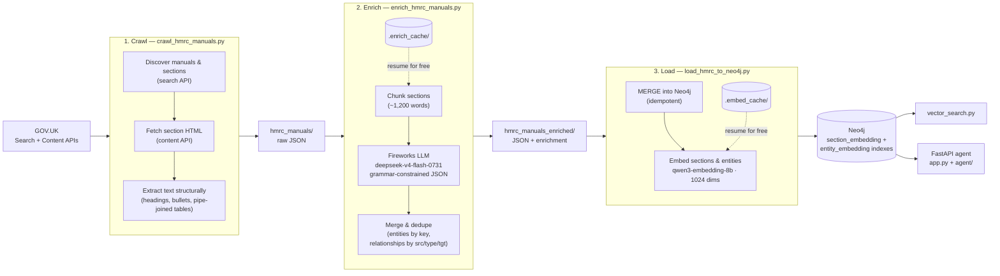

# HMRC Manuals Knowledge Graph

A Neo4j knowledge graph of the HMRC internal manuals, crawled from GOV.UK,
enriched with tax concepts and relationships by an LLM, and loaded with vector
embeddings - queried by semantic search and a small FastAPI tax agent.

## Pipeline



1. **Crawl** - `crawl_hmrc_manuals.py` discovers every manual and section via
   the GOV.UK Search API (`hmrc_manual`, `manual`, and flat publication
   formats, filtered to HMRC) and fetches each section's HTML from the Content
   API. Text is extracted structurally - headings kept, list items bulleted,
   table rows pipe-joined so tabular rate data survives.
2. **Enrich** - `enrich_hmrc_manuals.py` packs sections into ~1,200-word
   chunks and sends each to a Fireworks reasoning model
   (`deepseek-v4-flash-0731`) to extract entities and relationships. Results
   are cached per chunk (`.enrich_cache/`), so interrupted runs resume for
   free. Entities seen in multiple chunks merge into one node with their
   mentions unioned; relationships dedupe on (source, type, target) with
   evidence quotes unioned.
3. **Load** - `load_hmrc_to_neo4j.py` writes the graph with MERGE (idempotent
   - rerun only lands differences) and embeds section text and entity
   definitions with Fireworks `qwen3-embedding-8b` (reduced to 1024 dims via
   MRL), also cached (`.embed_cache/`).

## Graph model

Two layers:

- **Lexical structure** - `(:Document)-[:HAS_SECTION]->(:Section)`,
  `(:Section)-[:HAS_CHILD]->(:Section)`, `(:Section)-[:NEXT]->(:Section)`,
  `(:Section)-[:CROSS_REFERENCES]->(:Section)`.
- **Extracted knowledge** - `(:Entity)` nodes (merged globally on a
  normalised `key`, so the same concept extracted from different manuals is
  one node), linked by `(:Section)-[:MENTIONS]->(:Entity)`,
  `(:Document)-[:DISCUSSES]->(:Entity)` and 22 typed entity→entity
  relationships (`RELIEVES`, `HAS_RATE`, `SUBJECT_TO`, …), each carrying
  `evidence` quotes, `mentions`, and `created_from` (the manual slug).

## Why relationships and concepts, not a strict ontology

The point of the graph is that facts **join across 320+ manuals**. A strict
taxonomy - where each entity gets a bespoke type like
`CGTReliefForBusinessDisposal` - produces a different ontology per manual,
and nothing connects: entity types that don't appear in other files can't be
matched, merged, or queried uniformly.

Instead we extract **general concepts with closed, coarse types** (35 entity
types like `Relief`, `Threshold`, `StatutoryProvision`; 22 relationship types
like `EXEMPTS`, `HAS_DEADLINE`). The vocabulary is small and fixed, so
`Business Asset Disposal Relief` extracted from the Capital Gains Manual and
` Entrepreneurs' Relief` extracted from a different manual merge into one node
and their relationships interlink. Precision is traded for coverage and
joinability: fine-grained distinctions are preserved in the entity `name`,
`definition`, and relationship `evidence` rather than in the type system.

This architecture favors **semantic search** and **question answering** over strict reasoning: the model can find relevant sections and entities even if the query uses different words than the manuals, and it can answer questions by joining evidence across manuals. That is, the graph is designed to support agent based discovery of relevant information, rather than to be a formal knowledge base for deductive reasoning.

## How the LLM output is constrained

The extraction model doesn't produce free text that we then parse:

- **Grammar-constrained JSON** - requests use `response_format: json_schema`
  with `EXTRACTION_SCHEMA`, compiled by Fireworks into a grammar. The model
  can only emit JSON matching the schema - it cannot produce malformed
  output, extra properties, or omit fields (every property required,
  `additionalProperties: false`).
- **Closed enums** - `type` fields are **enums** over the fixed entity and
  relationship type lists, so the model can't invent new types.
- **Grounded fields** - `section_ids`, `evidence` quotes, and `definition`
  are constrained (by schema description) to come from the supplied chunk
  text, not invented.
- **Post-hoc validation** - relationships whose source/target aren't in the
  chunk's entity list, or whose type isn't in the enum, are dropped at merge
  time rather than trusted.

## Running the pipeline

### Setup

```bash
python3 -m venv .venv
.venv/bin/pip install -r requirements.txt

cp .env.example .env
# then edit .env: fill in the Fireworks key (needed from stage 2 on) and
# the Neo4j connection vars (needed for stage 3 and querying)
```

Run everything from the project root — all stages read `.env` from there.

### 1. Crawl (free, ~rate-limited)

```bash
.venv/bin/python3 crawl_hmrc_manuals.py              # everything, ~8 workers, 12 rps
.venv/bin/python3 crawl_hmrc_manuals.py --list-only  # just see what's there
.venv/bin/python3 crawl_hmrc_manuals.py --manuals capital-gains-manual
```

Writes `hmrc_manuals/<slug>.json`.

### 2. Enrich (paid, multi-hour, resumable)

```bash
.venv/bin/python3 enrich_hmrc_manuals.py             # all crawled manuals
.venv/bin/python3 enrich_hmrc_manuals.py --manuals capital-gains-manual
.venv/bin/python3 enrich_hmrc_manuals.py --dry-run   # see chunk counts / cost, no API calls
```

The full corpus is ~24M words — a full pass is a paid, multi-hour job, but
chunk results are cached in `.enrich_cache/`, so interrupting and rerunning
replays the cache for free. `--chunk-words` and `--max-tokens` are coupled
(the model is a reasoning model: bigger chunks burn the token ceiling on
reasoning and return nothing) — leave the defaults unless you raise both.

Writes `hmrc_manuals_enriched/<slug>.json`.

### 3. Load into Neo4j (embeddings are paid, graph writes are not)

```bash
.venv/bin/python3 load_hmrc_to_neo4j.py               # graph + embeddings
.venv/bin/python3 load_hmrc_to_neo4j.py --no-embed   # graph only, no embedding cost
.venv/bin/python3 load_hmrc_to_neo4j.py --dry-run
```

Every write is a MERGE, so the loader is idempotent — rerun it, or rerun it
after re-enriching a single manual, and only the differences land. Embeddings
are cached in `.embed_cache/` (also free on reruns).

### 4. Query

```bash
# Semantic search (JSON by default)
.venv/bin/python3 vector_search.py "relief for selling a business" --text

# API + web agent
.venv/bin/uvicorn app:app --port 8000   # http://localhost:8000
```

Every script takes `--help`; CLI flags override `.env`. See `AGENTS.md` for the
full search workflow and Cypher patterns.
