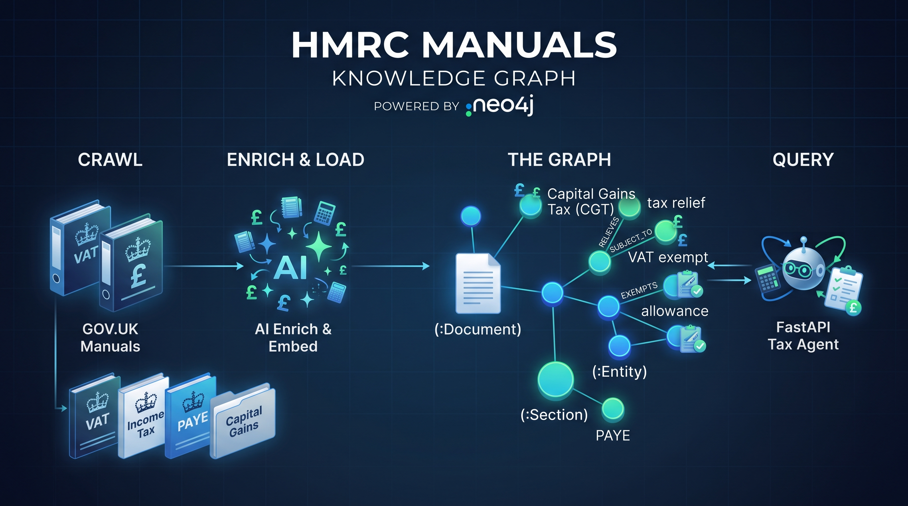
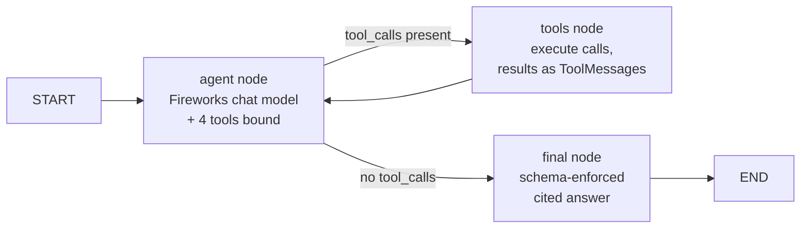

# HMRC Manuals Knowledge Graph

<p align="center">
  
</p>

A Neo4j knowledge graph of the HMRC internal manuals, crawled from GOV.UK,
enriched with tax concepts and relationships by an LLM, and loaded with vector
embeddings - queried by semantic search and a small FastAPI tax agent.

## Pipeline


1. **Crawl** - `crawl_hmrc_manuals.py` discovers every manual and section via
   the GOV.UK Search API (`hmrc_manual`, `manual`, and flat publication
   formats, filtered to HMRC) and fetches each section's HTML from the Content
   API. Text is extracted structurally - headings kept, list items bulleted,
   table rows pipe-joined so tabular rate data survives.
2. **Enrich** - `enrich_hmrc_manuals.py` packs sections into ~1,200-word
   chunks and sends each to a Fireworks reasoning model
   (`deepseek-v4-flash-0731`) to extract entities and relationships. Results
   are cached per chunk (`.enrich_cache/`), so interrupted runs resume for
   free. Entities seen in multiple chunks merge into one node with their
   mentions unioned; relationships dedupe on (source, type, target) with
   evidence quotes unioned.
3. **Load** - `load_hmrc_to_neo4j.py` writes the graph with MERGE (idempotent
   - rerun only lands differences) and embeds section text and entity
   definitions with Fireworks `qwen3-embedding-8b` (reduced to 1024 dims via
   MRL), also cached (`.embed_cache/`).

## Graph model

Two layers:

- **Lexical structure** - `(:Document)-[:HAS_SECTION]->(:Section)`,
  `(:Section)-[:HAS_CHILD]->(:Section)`, `(:Section)-[:NEXT]->(:Section)`,
  `(:Section)-[:CROSS_REFERENCES]->(:Section)`.
- **Extracted knowledge** - `(:Entity)` nodes (merged globally on a
  normalised `key`, so the same concept extracted from different manuals is
  one node), linked by `(:Section)-[:MENTIONS]->(:Entity)`,
  `(:Document)-[:DISCUSSES]->(:Entity)` and 22 typed entity→entity
  relationships (`RELIEVES`, `HAS_RATE`, `SUBJECT_TO`, …), each carrying
  `evidence` quotes, `mentions`, and `created_from` (the manual slug).

## Graph architecture and how it is built

### Node and relationship inventory

| Element | Properties | How many |
|---|---|---|
| `(:Document)` | `title`, `slug`, `url`, `description` | one per manual cover page |
| `(:Section)` | `heading`, `section_id`, `text`, `url`, `position`, `embedding` | ~84k |
| `(:Entity)` | `key`, `name`, `type`, `definition`, `aliases`, `embedding`, `created_from` | ~237k |
| `(:Document)-[:HAS_SECTION]->(:Section)` | - | manual → top-level pages |
| `(:Section)-[:HAS_CHILD]->(:Section)` | - | page hierarchy |
| `(:Section)-[:NEXT]->(:Section)` | - | reading order within a parent |
| `(:Section)-[:CROSS_REFERENCES]->(:Section)` | - | explicit links in the prose |
| `(:Document)-[:DISCUSSES {salience, salience_rank, mentions}]->(:Entity)` | | per-(manual, entity) |
| `(:Entity)-[:MENTIONED_IN]->(:Section)` | - | per-(entity, section) |
| 22 typed `(:Entity)-[:REL]->(:Entity)` | `evidence[]`, `mentions`, `created_from` | - |

Two things are worth calling out:

- **Entity nodes carry no `salience`** - it is only on the `DISCUSSES` edge.
  Salience is a judgement a manual makes about a concept ("the Capital Gains
  Manual is substantially about Business Asset Disposal Relief"), not a
  property of the concept itself: the same entity can be `primary` in one
  manual and `mentioned` in another. Since entities MERGE globally on `key`,
  a node-level property would have the manuals fighting to overwrite each
  other. `MENTIONED_IN` is likewise merged without properties - it is just
  the section-level link.
- **Every entity→entity relationship carries provenance**: `evidence` (a
  list of quotes from the manual text), `mentions`, and `created_from` -
  the `Document.slug` of the manual the edge was extracted from. A fact in
  the graph is never just asserted; you can always pull the quote and the
  source manual behind it.

### How each part is constructed

**Lexical layer (crawl + load).** The crawler discovers every manual and
section via the GOV.UK Search API and fetches each page's HTML from the
Content API, extracting text structurally (headings kept, list items
bulleted, table rows pipe-joined). The loader MERGEs one `Document` per
manual, one `Section` per page (keyed on `section_id`), then wires
`HAS_SECTION`, `HAS_CHILD`, `NEXT` (from each parent's child ordering) and
`CROSS_REFERENCES` (from links found in the text).

**Entities (enrich).** Each manual is chunked (~1,200 words) and every
chunk goes to the extraction model with the grammar-constrained
`EXTRACTION_SCHEMA` (see [How the LLM output is constrained](#how-the-llm-output-is-constrained)).
The model returns `entities[]` with `name`, `type` (closed enum of 35),
`definition`, `aliases`, `section_ids` and `salience`
(`primary|secondary|mentioned`).

**Entity identity - the normalised `key`.** Across chunks, entities merge
on `norm(name)` (`enrich_hmrc_manuals.py:555`): lowercase, strip leading
articles, drop punctuation, collapse whitespace - so "the CGT relief" and
"CGT Relief" fold to one node. On merge, the longest definition wins, the
highest salience wins (`SALIENCE_RANK`: primary 3 > secondary 2 >
mentioned 1), and aliases / `section_ids` union. Aliases are also folded
into resolution, so a relationship whose endpoint is stated as an alias
still resolves to the canonical entity.

**`MENTIONED_IN` (load).** For each merged entity, its validated
`section_ids` (dropped at merge time if not among the manual's real
section ids) are unwound and MERGEd as
`(Entity)-[:MENTIONED_IN]->(Section)` - propertyless, since it is just
"this concept appears on this page".

**`DISCUSSES` (load).** For each entity the loader MERGEs
`(Document {slug})-[di:DISCUSSES]->(Entity {key})`, then sets the
edge-level properties (`load_hmrc_to_neo4j.py:352-357`):

- `di.salience` / `di.salience_rank` - upgraded monotonically: a rerun only
  raises salience, never lowers it (`salience_rank` guard), so reloading
  is idempotent even when chunks disagree.
- `di.mentions` - accumulated chunk count.

Because the edge is per (manual, entity), the same concept extracted from
five manuals yields five `DISCUSSES` edges with independent salience -
and one joined entity node. That is the mechanism that makes the graph
queryable per-manual while joining across manuals.

**Entity→entity relationships (enrich + load).** The model also returns
`relationships[]` (`source`, `type` from a closed enum of 22, `target`,
`evidence`, `section_ids`). At merge time, both endpoints must resolve to
a known entity (by key or alias) and the type must be in the enum -
otherwise the edge is dropped; dangling edges are forbidden even though
the prompt already asks for it. Edges dedupe on
(normalised source, type, normalised target), with evidence quotes
unioned. At load time, the type is baked into a per-type Cypher template
(plain Cypher cannot MERGE a dynamic relationship type), so the edge type
itself carries the semantics: `(Relief)-[:RELIEVES]->(Charge)`.
`evidence` and `mentions` are SET on the edge, and `created_from` records
the manual slug on first creation.

**Embeddings (load).** Section `text` and entity `definition` are embedded
with Fireworks `qwen3-embedding-8b` (1024 dims via MRL) and stored as
`Section.embedding` / `Entity.embedding`, backed by the vector indexes
`section_embedding` and `entity_embedding` - this is what
`vector_search.py` and the agent's `semantic_search` tool query. Query
vectors must come from the same model, which is why the loader and
`vector_search.py` share the embedding call.

**Centralities (compute_centralities.py, offline).** The entity graph is
also scored globally: `Entity.pagerank` (normalised so the most central
concept is 1.0), `Entity.community` and `Entity.community_size`.
The batch script projects the entity graph - excluding hub noise
(`RELATED_TO`/`REFERENCES`/`EXAMPLE_OF` edges, `ADMINISTERED_BY`/
`GOVERNED_BY`, and `Organisation`/`Jurisdiction` entities) and weighting
edges by `mentions` - then runs PageRank, Louvain and WCC. Two backends:
Aura Graph Analytics (`gds.graph.project` / `gds.pageRank.mutate` /
`gds.louvain.mutate` / `gds.wcc.mutate`, then
`gds.graph.nodeProperties.write`; needs ~8GB of session memory for this
graph), auto-detected, with a pure-Python PageRank + union-find fallback
for instances without it. The agent never runs algorithms at query time -
it reads the properties (see the `centrality` tool), and treats them as
routing hints, not citable facts: there is no section URL behind a
PageRank score.

### Idempotency

Every write in stage 3 is a MERGE keyed on stable identifiers
(`slug`, `section_id`, entity `key`, relationship
source/type/target), so the whole load is idempotent: rerun it after
re-enriching a single manual and only the differences land. The two
known accumulation quirks are `di.mentions` (summed on every rerun - treat
it as an upper bound) and the monotonic salience upgrade (which is the
intended behaviour).

## Why relationships and concepts, not a strict ontology

The point of the graph is that facts **join across 320+ manuals**. A strict
taxonomy - where each entity gets a bespoke type like
`CGTReliefForBusinessDisposal` - produces a different ontology per manual,
and nothing connects: entity types that don't appear in other files can't be
matched, merged, or queried uniformly.

Instead we extract **general concepts with closed, coarse types** (35 entity
types like `Relief`, `Threshold`, `StatutoryProvision`; 22 relationship types
like `EXEMPTS`, `HAS_DEADLINE`). The vocabulary is small and fixed, so
`Business Asset Disposal Relief` extracted from the Capital Gains Manual and
` Entrepreneurs' Relief` extracted from a different manual merge into one node
and their relationships interlink. Precision is traded for coverage and
joinability: fine-grained distinctions are preserved in the entity `name`,
`definition`, and relationship `evidence` rather than in the type system.

This architecture is a deliberate bet on **agentic retrieval** over
zero-shot GraphRAG. A strict ontology is optimized for one-shot querying: the
answer must be reachable by a single traversal from a single entry point, so
any error or gap in the taxonomy - a missing subclass, a wrong type
assignment, two manuals naming the same concept differently - becomes a dead
end with no recovery path. Our concept graph is optimized for the opposite:
an agent that searches, reads evidence, rephrases, and traverses again. With
coarse types the graph rarely dead-ends - an agent that lands on a slightly
wrong node still sees its neighbours, its `MENTIONED_IN` sections, and the
`evidence` quotes on each relationship, which is usually enough to notice the
mis-step and re-anchor on the right `key` or `section_id`. The fine-grained
distinctions a strict ontology would encode as types live in the entity
`name`, `definition`, and relationship `evidence`, where the agent can read
and verify them instead of having to guess them at query-construction time.

There is empirical support for this bet. Recent benchmarks show that agentic,
multi-round retrieval narrows or closes the gap that graph structure is
supposed to provide: *RAGSearch* ([arXiv:2604.09666](https://arxiv.org/abs/2604.09666))
finds that agentic search "substantially improves dense RAG and narrows the
performance gap to GraphRAG", with the residual GraphRAG advantage appearing
only on complex multi-hop reasoning - exactly the case where an agent can
iterate rather than needing the perfect first hop. *RAG vs. GraphRAG*
([arXiv:2502.11371](https://arxiv.org/abs/2502.11371)) finds the two are
complementary, with plain RAG winning on single-hop factual queries and
GraphRAG on multi-hop reasoning - and this project gets both sides of that
split, since the agent can do a plain vector search when the question is
simple and traverse relationships when it isn't. And work on agentic graph
search itself - *GraphSearch* ([arXiv:2509.22009](https://arxiv.org/abs/2509.22009)),
iterative retrieval in GraphRAG
([arXiv:2509.25530](https://arxiv.org/abs/2509.25530)) - reports that
multi-round retrieval over an entity–relation graph surfaces evidence that
static, one-shot retrieval misses, while keeping the graph's cost advantage
over embedding-only pipelines.

In short: the graph is designed to support agent-based discovery of relevant
information - semantic search to find candidate nodes, typed relationships
with evidence to traverse and verify them - rather than to be a formal
knowledge base for deductive reasoning. The ontology is coarse because the
agent, not the schema, is what resolves the fine-grained distinctions.

## Agentic Loop Design

The tax agent (`app.py` + `agent/`) is a LangGraph tool loop in
`agent/graph.py`, built around the retrieval design above: **search →
expand by id → read**, with the model - not a fixed pipeline - deciding
what to do next at every step.

### The loop

The compiled graph has three nodes and two edges:



1. **`agent` node** - the Fireworks chat model (temperature 0) is invoked
   with the system prompt, the conversation so far, and the five tools
   from `agent/tools.py` bound: `semantic_search`, `expand`,
   `read_sections`, `centrality` (global importance / ego-network
   ranking - routing hints, not citable facts), and `cypher` (read-only
   escape hatch). It either emits one or more tool calls or plain
   content.
2. **Routing** - a conditional edge inspects only the last message:
   `tool_calls` present → `tools`; absent → `final`. There is no explicit
   stop tool or token; *not calling a tool* is itself the decision to
   stop.
3. **`tools` node** - executes the requested calls, returning results as
   `ToolMessage`s (capped at 20k chars; errors become tool results rather
   than exceptions), then loops back to `agent`. The tool docstrings are
   part of the design: `semantic_search` returns section `id`s and entity
   `key`s, and `expand` / `read_sections` consume those ids directly, so
   the model is steered away from re-finding nodes with unindexable text
   scans and toward id-anchored traversal.
4. **`final` node** - runs exactly once and terminates the graph. The
   conversation is flattened (tool results become user-role context so
   the chat API never sees unmatched tool-call frames) and one direct
   Fireworks call is made with `response_format: json_schema`, enforcing
   the citation contract: `answer` + `sources` (title/url) + `graph_refs`
   (from_entity/relationship/to_entity). Every claim must cite the
   section URLs actually used; if the graph didn't contain the answer,
   the model must say so and leave `sources` empty. If the model ignores
   the schema, its raw text is surfaced as the answer with empty
   citations rather than failing the request.

### Stopping

Stopping is **model-driven with a hard backstop**:

- **Primary: the model decides.** When it judges it has enough evidence,
  it simply stops emitting tool calls and produces content instead -
  that routes to `final`. The system prompt (`agent/prompt.py`) steers
  this judgement; there is no round counter the model must obey.
- **Backstop: `MAX_TOOL_ROUNDS = 8`.** The `tools` node counts tool
  rounds in the LangGraph state (declared as a state channel - LangGraph
  silently drops update keys that aren't channels). Past the limit, tool
  calls are no longer executed; each one gets a `ToolMessage` saying
  *"Tool round limit reached - produce your final cited answer now with
  what you have"*. The model's next tool-free turn then routes to
  `final`, so the graph can only ever exit through the `final` node -
  it cannot loop forever, and it cannot end without a schema-conformant
  (or explicitly schema-ignored) cited answer.

### Serving

`app.py` wraps this in FastAPI: `POST /api/chat` runs the agent and
returns the final answer; `POST /api/chat/stream` streams SSE events
(each `tool_call` as it happens, then the `answer`); and the answer's
subgraph is rendered to a self-contained visualization served at
`/viz/{viz_id}`.

FastAPI is the **serving layer** of the architecture: it wraps the LLM
tax agent (`app.py` + the `agent/` package) in a web API on top of the
Neo4j knowledge graph. Its four endpoints are:

- `POST /api/chat` - non-streaming: runs the agentic loop (`run_agent`)
  and returns the final structured, cited answer.
- `POST /api/chat/stream` - streaming: emits SSE events so the UI shows
  each `tool_call` as the agent works, followed by the `answer`.
- `GET /` - serves the chat web UI (`static/index.html`).
- `GET /viz/{viz_id}` - serves the self-contained Neo4j visualization of
  the subgraph that produced an answer.

Its role is a thin HTTP wrapper - request validation (Pydantic
`ChatRequest`), SSE streaming, and static file serving - while all the
intelligence lives in the agent package (the agentic loop over the
graph/vector search) and the graph itself.

## How the LLM output is constrained

The extraction model doesn't produce free text that we then parse:

- **Grammar-constrained JSON** - requests use `response_format: json_schema`
  with `EXTRACTION_SCHEMA`, compiled by Fireworks into a grammar. The model
  can only emit JSON matching the schema - it cannot produce malformed
  output, extra properties, or omit fields (every property required,
  `additionalProperties: false`).
- **Closed enums** - `type` fields are **enums** over the fixed entity and
  relationship type lists, so the model can't invent new types.
- **Grounded fields** - `section_ids`, `evidence` quotes, and `definition`
  are constrained (by schema description) to come from the supplied chunk
  text, not invented.
- **Post-hoc validation** - relationships whose source/target aren't in the
  chunk's entity list, or whose type isn't in the enum, are dropped at merge
  time rather than trusted.

## Running the pipeline

### Setup

```bash
python3 -m venv .venv
.venv/bin/pip install -r requirements.txt

cp .env.example .env
# then edit .env: fill in the Fireworks key (needed from stage 2 on) and
# the Neo4j connection vars (needed for stage 3 and querying)
```

Run everything from the project root - all stages read `.env` from there.

### 1. Crawl (free, ~rate-limited)

```bash
.venv/bin/python3 crawl_hmrc_manuals.py              # everything, ~8 workers, 12 rps
.venv/bin/python3 crawl_hmrc_manuals.py --list-only  # just see what's there
.venv/bin/python3 crawl_hmrc_manuals.py --manuals capital-gains-manual
```

Writes `hmrc_manuals/<slug>.json`.

### 2. Enrich (paid, multi-hour, resumable)

```bash
.venv/bin/python3 enrich_hmrc_manuals.py             # all crawled manuals
.venv/bin/python3 enrich_hmrc_manuals.py --manuals capital-gains-manual
.venv/bin/python3 enrich_hmrc_manuals.py --dry-run   # see chunk counts / cost, no API calls
```

The full corpus is ~24M words - a full pass is a paid, multi-hour job, but
chunk results are cached in `.enrich_cache/`, so interrupting and rerunning
replays the cache for free. `--chunk-words` and `--max-tokens` are coupled
(the model is a reasoning model: bigger chunks burn the token ceiling on
reasoning and return nothing) - leave the defaults unless you raise both.

Writes `hmrc_manuals_enriched/<slug>.json`.

### 3. Load into Neo4j (embeddings are paid, graph writes are not)

```bash
.venv/bin/python3 load_hmrc_to_neo4j.py               # graph + embeddings
.venv/bin/python3 load_hmrc_to_neo4j.py --no-embed   # graph only, no embedding cost
.venv/bin/python3 load_hmrc_to_neo4j.py --dry-run
```

Every write is a MERGE, so the loader is idempotent - rerun it, or rerun it
after re-enriching a single manual, and only the differences land. Embeddings
are cached in `.embed_cache/` (also free on reruns).

### 4. Centralities (optional, GDS session is metered while it runs)

```bash
.venv/bin/python3 compute_centralities.py --memory 8   # GDS when available
.venv/bin/python3 compute_centralities.py --backend python --dry-run
```

Writes `Entity.pagerank` / `community` / `community_size` (see
[Graph architecture](#graph-architecture-and-how-it-is-built)). Rerun it
after re-enriching or reloading; reruns are idempotent.

### 5. Query

```bash
# Semantic search (JSON by default)
.venv/bin/python3 vector_search.py "relief for selling a business" --text

# API + web agent
.venv/bin/uvicorn app:app --port 8000   # http://localhost:8000
```

Every script takes `--help`; CLI flags override `.env`. See `AGENTS.md` for the
full search workflow and Cypher patterns.
